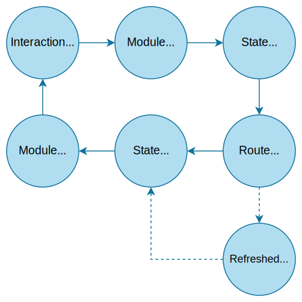

# Modules Overview

**Cannoli Modules** are multi-featured UI modules with a state and interactions that are persisted to a database. They have containerized behavior and are resumable following application restarts. Module interactions by default have *single threaded guarantees*, so they have predictable behavior and safe access to states. 

These modules can be used to create many kinds of streamlined UI interactions.

Use the guides in the Modules section to learn more. You can find full examples in the [Demo project](https://github.com/codethecodeman/CannoliKit/tree/main/Demo).

## Lifecycle



## Using Cannoli Modules

To create a module, create a class that inherits `CannoliModule<TContext, TState>` where:
- `TContext` is a derived `DbContext` that implements `ICannoliDbContext` (see [EF Core Setup](../getting-started/database.md)).
-  `TState` is a derived `CannoliModuleState`, and has a parameterless constructor `new()`.

This will require you to implement the method `BuildLayout()`, responsible for creating the Discord embed and components, like buttons, for this module any time it is refreshed.

## Utility Properties and Methods

The following utilities are inherited.

| Property    | Description |
| -------- | ------- |
| `DiscordClient`  | The corresponding `DiscordSocketClient`. |
| `Db` | An instance of your derived `DbContext`, e.g. `FooDbContext`. Changes are automatically saved. |
| `State`    | The module's persistent state. Changes are automatically saved. |
| `User`    | The `SocketUser` that started this interaction. |
| `Cancellation`    | Settings related to the user's ability to cancel/quit the module. |
| `Alerts`    | Settings related to alert messages. |
| `Pagination`    | Settings related to setting up pagination. |
| `RouteManager`    | Utility for creating new Cannoli Routes. |
| `ReturnRoutes`    | Cannoli Routes that have been passed in from a referring module. |

| Method    | Description |
| -------- | ------- |
| `RefreshModule()`  | Modifies the Discord interaction's response with a refreshed module, using the `BuildLayout()` method. |

## Basic Setup

```csharp
public class HelloWorldModule : CannoliModule<FooDbContext, HelloWorldState>
{
    public HelloWorldModule(
        DemoDbContext db,
        DiscordSocketClient discordClient,
        CannoliModuleFactoryConfiguration factoryConfiguration) 
        : base(db, discordClient, factoryConfiguration) { }

    protected override async Task<CannoliModuleLayout> BuildLayout()
    {
        var embedBuilder = new EmbedBuilder
        {
            Title = "Hello world!",
            Timestamp = DateTimeOffset.UtcNow
        };

        if (State.LastHelloOn != null)
        {
            embedBuilder.Description = $"Last Hello received on {State.LastHelloOn.Value}";
        }

        var componentBuilder = new ComponentBuilder()
            .WithButton(
                label: "Hello",
                customId: await RouteManager.CreateMessageComponentRouteAsync(
                    callback: OnHello));

        return new CannoliModuleLayout
        {
            EmbedBuilder = embedBuilder,
            ComponentBuilder = componentBuilder
        };
    }

    private async Task OnHello(SocketMessageComponent messageComponent, CannoliRoute route)
    {
        State.LastHelloOn = DateTime.UtcNow;
        await RefreshModuleAsync();
    }
}
```
