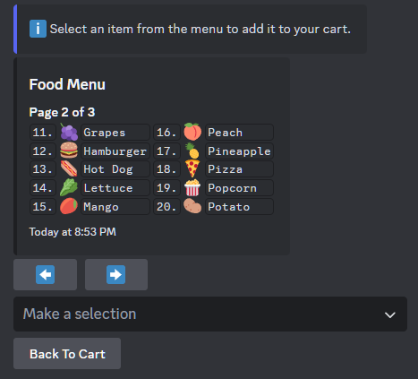

# Module Pagination

Cannoli Modules have built-in support for Discord embed pagination. Anything you can stuff into an `IList<T>` can be paginated.



## Setup

Within `BuildLayout()`, use the `Pagination` utility for setup. Among other options, you will want to specify your list of items, a formatter for the items, and a list type. 

```csharp
var paginationResult = Pagination.Setup(
    items: menuItems,
    formatter: x => $"`{x.Marker}` {x.Item.Emoji} `{x.Item.Name}` ",
    listType: ListType.Number,
    numItemsPerRow: 2,
    numItemsPerPage: 10,
    numItemsPerField: 10);
```

## Applying Pagination Results

The `Setup()` method returns a `PaginationResult` that you can use within your layout. This contains some useful properties, particularly:
- `Fields`, a list of EmbedFieldBuilders corresponding to the current page.
- `Items`, a list of items corresponding to the current page.

After setup, pagination arrows will be automatically applied your Discord response whenever the module is refreshed.

```csharp
var fields = new List<EmbedFieldBuilder>();
fields.AddRange(paginationResult.Fields);

var embedBuilder = new EmbedBuilder
{
    Title = "Menu Items",
    Fields = fields,
};
```
