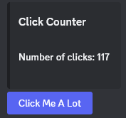

# Routing

Cannoli Modules utilize Discord components like buttons, select menus, and modals via a system called **Cannoli Routes**. These tie interactions to a unique module, state, and callback.

## Route Management

Routes are created using the inherited utility `RouteManager`. It has the following methods:
- `CreateMessageComponentRoute`, to be used with buttons, select menus, etc.
- `CreateModalRoute`, to be used with modal submissions.

Routes are expected to be plugged in as a `CustomId` for Discord components.

```csharp
var buttons = new List<ButtonBuilder>
{
    new()
    {
        Label = "Send Email",
        Style = ButtonStyle.Primary,
        CustomId = await RouteManager.CreateMessageComponentRoute(
            callback: OnSendEmail)
    }
};

// ...

private async Task OnSendEmail(SocketMessageComponent messageComponent, CannoliRoute route)
{
    // ...
}
```

## Static Routes

By default, when you call `RefreshModule()`, all existing routes will be deleted with the expectation that new routes will be created in your `BuildLayout()` method. This works especially well with ephemeral modules.

In some cases, that may not be desirable. If the module is public facing and expected to handle many interactions, a user may click a button only to find that the associated route has been deleted.



Static routes alter this behavior by ensuring the route is not deleted when a module refresh occurs. Simply use the `routeName` parameter to specify a unique name for the route. Next time `RouteManager` tries to create the route, it will use the existing route with the given name rather than creating a new one.

```csharp
var buttons = new List<ButtonBuilder>
{
    new()
    {
        Label = "Click Me A Lot",
        Style = ButtonStyle.Primary,
        CustomId = await RouteManager.CreateMessageComponentRoute(
            callback: OnClickMe,
            routeName: "FooClickMeRoute")
    }
};
```

## Passing Routes

Cannoli Modules sometimes redirect to other modules within their workflow. For example, a `CartModule` might open a `MenuModule` to select items to add to a cart. You may wish for the user to return to their cart after an item is selected. To handle that, use the `RouteConfigurationBuilder` when using an `ICannoliModuleFactory`. You can find a full example in the [Demo project](https://github.com/codethecodeman/CannoliKit/tree/main/Demo).

### Example setup in `CartModule`

Here, we use the builder to pass a custom cancellation route and item selection route. The item selection route is given a unique name tag and will be referred to later.

```csharp
var builder = new RouteConfigurationBuilder();

var menuModule = _cannoliModuleFactory.CreateModule<MenuModule>(
    requestingUser: User,
    routing: builder
        .WithCancellationRoute(
            routeId: await RouteManager.CreateMessageComponentRoute(
                callback: OnRefreshCart))
        .WithReturnRoute(
            tag: "ItemSelected",
            routeId: await RouteManager.CreateMessageComponentRoute(
                callback: OnItemSelected))
        .Build());

await messageComponent.ModifyOriginalResponseAsync(menuModule);
```

### Example setup in `MenuModule`

Here, we refer back to the item selection route in the module's select menu via the inherited `ReturnRoutes` property. This makes it so when an item is selected, the result will be passed back to the referring `CartModule`.

```csharp
 var menuBuilder = new SelectMenuBuilder
 {
     CustomId = ReturnRoutes["ItemSelected"]
 };
```